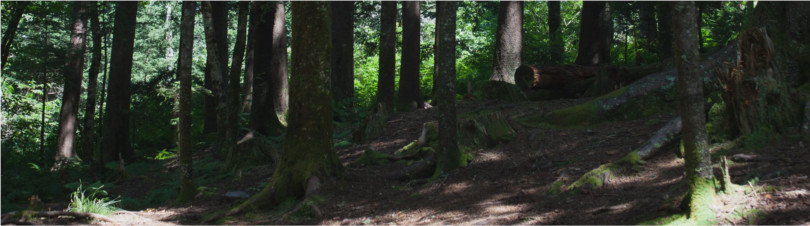

<!--
### Materials

{height=100px}
-->

#### To read beforehand

See [about, goals, setting up & introduction](Bioimage-analysis_01_Introduction.qmd) for 
course topics, philosophy and goals.

--------------------------------------------------------------------------------

#### Afternoon I

1. [About, goals, setting up & introduction](Bioimage-analysis_01_Introduction.qmd)
2. Working with images
    a. [Reading, modifying and displaying images](Bioimage-analysis_02A_Readingwritingmodifying.qmd)
    b. [How computers represent numbers](Bioimage-analysis_02B_Computersrepresentingdata.qmd)
        - **Topics**
            - Reading/writing/displaying images
            - Images are tables with values (arrays)
            - Working with arrays
            - Data types
            - Relating pixels to real-world units
3. Image Processing
    a. [Image Processing (part 1)](Bioimage-analysis_03A_Imageprocessing.qmd)

--------------------------------------------------------------------------------

#### Afternoon II

3. Image processing (continued)
    b. [Image Processing (part 2)](Bioimage-analysis_03B_Imageprocessing.qmd)    
        - **Topics**
            - Applying math to images
            - Segmentation of images
                - Masks, labels and regions
            - Convolutions
            - Morphology operations     
            
--------------------------------------------------------------------------------

#### Afternoon III
         
4. [Good coding practices](Bioimage-analysis_04_Intermezzo-goodcodingpractices.qmd)
    - **Topics**
        - Importance of readable code
        - Style guides
        - Modularity
        - Refactoring
        - Not included (????): 
            - using version trackers 
            - online repositories (github)
            - environment managers
5. [Combining building blocks into a pipeline](Bioimage-analysis_05_Pipelines.qmd)
    - [Link to v.2.](answers/Bioimage-analysis_05_REVISED.qmd)
    - **Topics**
        - Working with (large) image sets
        - Human-in-the loop, Napari package
6. [Machine learning fundamentals (basics)](Bioimage-analysis_06_MachineLearning-basics.qmd)
    - **Topics**    
        - Machine learning fundamentals;
            - Neural networks
            - Forward propagation
            - Loss function, training, weights
            - Some basic Pytorch concepts
        - Not included:
            - Activation functions
            - Neural network architectures
7. [Plotting](Bioimage-analysis_07_Plotting.qmd)

--------------------------------------------------------------------------------

### Course outline

    
#### Day 2
- Data processing pipelines
- Machine learning
- Good coding practices
    - Documentation
    - Version control
    - Modularity
    - Reproduction packages

#### Day 3
- From raw data to plot
    - Dataframes 
    - Matplotlib
    - Seaborn
    

#### Topics to still include

- Background corrections
- Thresholding, specificially global vs. local

--------------------------------------------------------------------------------

{height=100px}

### The forbidden zone 

2. [Answers to exercises 02](answers/Bioimage-analysis_02_answers.qmd)
3. Answers to exercises 03
    a. [Answers to exercises 03a](answers/Bioimage-analysis_03a_answers.qmd)
    b. [Answers to exercises 03b](answers/Bioimage-analysis_03b_answers.qmd)
4. [Answers to exercises 04](answers/Bioimage-analysis_04_answers.qmd)
5. [Answers to exercises 05](answers/Bioimage-analysis_05_answers.qmd)

